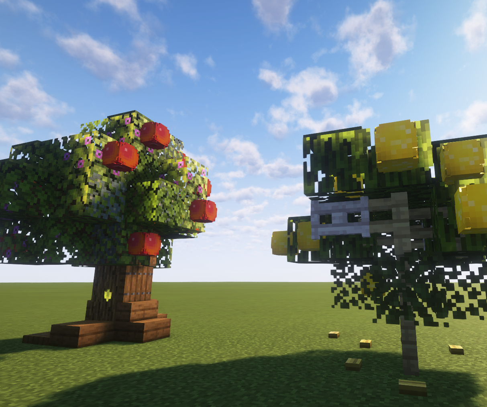

# Garden

### Garden adds fruit trees and berry bushes to the game.

Firstly you need to find some seeds, they can be found in short grass or tall grass. To plant the seed, simply place it down on a grass block.

It takes time for plants to grow, you can see the progress of the plant growth as it grows in stages. After a while, the plant will be ready to bear fruits, which you can harvest using shears.

The plugin has integrations with BreweryX and TheBrewingProject, and is currently mainly meant as an addition to those plugins, but it can still function on its own.
